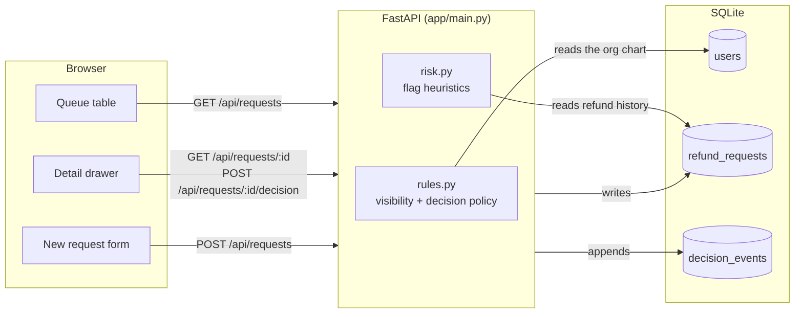
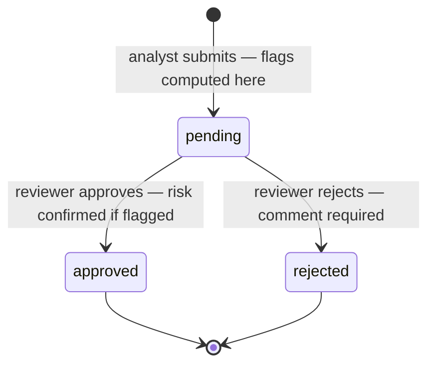
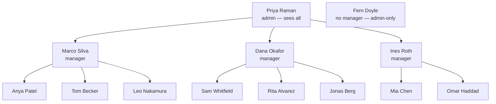

# Refund review (demo)

A queue for reviewing customer refund requests: an analyst submits one, a reviewer
approves or rejects it, and both see the decision history.

**Nothing is executed.** Approving a request records a decision; no payment provider
is called and no money moves.

> [!IMPORTANT]
> Before building on this: [Known gaps](#known-gaps--read-before-reusing-this-on-real-money)
> lists what a real refund platform needs that this deliberately does not have, and
> [Reuse for future internal tools](#reuse-for-future-internal-tools) covers what
> ports to another review queue and what does not.

## Run it

Two terminals.

```bash
# backend — http://127.0.0.1:8000
cd backend
python3 -m venv .venv && .venv/bin/pip install -r requirements.txt
.venv/bin/python -m app.seed          # drops and reseeds the demo database
.venv/bin/uvicorn app.main:app --reload
```

```bash
# frontend — http://localhost:5173 (proxies /api to the backend)
cd frontend
npm install
npm run dev
```

## Signing in

Sign in with a **user id** and the shared demo password `refunds123`. The seed
script prints every id with its name and role; a quick tour is id **1** (admin,
sees everything), **3** (manager, sees her three reports), **9** (analyst, sees
only her own).

What the login is and is not: passwords are salted and stretched with pbkdf2,
and a successful login mints a random token stored server-side, so signing out
revokes it. There is no SSO, no password reset, no rate limiting, and the token
lives in `localStorage` behind a bearer header rather than a `Secure; HttpOnly`
cookie. One password for thirteen fake people is a demo convenience, not a
pattern to copy.

## Architecture

A React SPA talks to a FastAPI service over JSON; the service owns every rule and
SQLite holds the data. The frontend hides buttons it knows are pointless, but it is
not the security boundary — the same checks run again on the server, so a crafted
request gets the same answer as a clicked one.



Every call carries an `Authorization: Bearer <token>` header; the API looks the
token up in the `sessions` table and derives the user from it, so the browser
cannot claim to be someone else. `users.manager_id` is a self-referencing foreign
key, so the org chart is read live: reorg someone and their in-flight requests
move to the new manager.

### Request lifecycle

A request is decided at most once. The write is a conditional update
(`UPDATE ... WHERE status = 'pending'`), so when two reviewers click at the same
moment the loser gets a 409 rather than silently overwriting the winner.



`decision_events` is append-only — submissions and decisions are both rows in it,
and `refund_requests.status` is a rollup kept for cheap filtering. Nothing edits
history.

## Hierarchy and visibility

Visibility follows the reporting line: **your own requests, plus your direct
reports'**. Not your skip-levels — a director does not automatically see their
reports' reports, by design. Admins see everything.



| Viewer | Sees | Can decide |
| --- | --- | --- |
| Analyst | only their own requests | nothing |
| Manager | their own + their direct reports' | their reports' requests, never their own |
| Admin | everything | everything except their own requests |

Two consequences worth knowing:

- **Requests outside your line return 404, not 403.** A 403 would confirm the id
  exists, which lets someone map another team's volume by probing ids.
- **Nobody approves their own request, admins included.** A manager's own refund
  goes up to *their* manager. Fern Doyle reports to no one, so her requests are
  decidable only by an admin — the deliberate edge case in the seed data.

### When a reviewer leaves

People get deactivated mid-queue, and their reports' pending requests must not
quietly become invisible. Two things happen instead:

- **The queue moves one hop up.** Deactivate a manager and their reports' requests
  appear for *that manager's* manager, who can decide them. One hop only — the
  same reason skip-levels are excluded normally.
- **A request with nobody active above it is labelled `Unassigned`** in the queue
  and in the drawer, so an admin can see it needs picking up rather than
  discovering it months later.

Deactivating someone, changing their role, or moving them under a new manager all
go through `PATCH /api/users/{id}` (admins only), and **every one of those changes
revokes that person's live sessions**. Otherwise a demoted manager keeps manager
powers until their twelve-hour token expires. A deactivated account can neither
sign in nor use an existing token.

### Aging

Pending requests carry how long they have waited. Past **3 days** they are marked
due, past **7 days** overdue, and the counter above the queue shows how many are
overdue. Within the pending block the queue is ordered oldest-first, so an SLA
breach rises rather than sinking under newer submissions, and the list is paged
(25 at a time, **Load more** for the rest) instead of returning everything.
Decided requests stop aging: how long it sat is history, not work.

## Flags and alerts

Flags are heuristics computed **once, at submit time**, and stored on the request.
They are frozen deliberately: reopening a six-month-old decision should show what
the reviewer actually saw, not what today's rules would say.

| Flag | Trigger | Why it matters |
| --- | --- | --- |
| High value | amount over $1,000 | the expensive mistake to make by reflex |
| Repeat refunds | 2+ approved refunds for this customer in 90 days | a pattern one request can't show |
| Rapid succession | 2+ requests for this customer in 24 hours | bursts look like testing a stolen card |
| Fraud dispute | the submitter chose that reason | the analyst is already suspicious |

What the flags *do*, in escalating order:

1. **No flags** — approve or reject straight away.
2. **Any one flag** — the reviewer must tick a confirmation checkbox before the
   approve button unlocks. Same approver, just friction against the reflex click.
3. **High value _plus_ any other flag** — the manager is blocked entirely and an
   admin has to approve. The drawer says so instead of offering a dead button.

Rejecting never needs risk confirmation, but always needs a comment — a decline is
the decision someone will later ask you to justify. Use the **Flagged only** filter
to triage the risky queue first.

## Known gaps — read before reusing this on real money

This is a review tool, not a refund system. The queue, the authorization and the
audit log are the honest parts; everything below is deliberately absent, and each
one is a way to pay a customer twice.

> [!CAUTION]
> **Nothing caps the total refunded against an order.** Three approved $40
> refunds on a $50 order all pass, because each is checked in isolation. Closing
> it means a refunded-to-date total per order, checked **at approval**, not at
> submit — the order can be refunded elsewhere while a request sits pending.

> [!CAUTION]
> **The chargeback race is not handled.** A customer disputes with their bank
> while the request is pending; approve it and they are paid twice. Real
> platforms re-check dispute status at the moment of execution and block.

> [!WARNING]
> **Approval is not execution, and there is no execution.** When money actually
> moves you need the provider's idempotency key on the *execution* call, plus a
> visible `failed` state — an approved refund whose capture fails must land in a
> queue someone works, not disappear.

> [!WARNING]
> **Decisions are final.** No withdraw, no appeal, no reversal. Every refund team
> eventually needs "approved in error", and it has to be a new row in
> `decision_events`, never an edit to an old one.

> [!NOTE]
> **Risk flags are a snapshot, not a live view.** They freeze at submit
> (`risk.compute_flags`). A request reviewed a week later shows the risk as it
> was, though the customer may have filed five more since. Keep the frozen copy
> for the audit trail and recompute a second, live view for the reviewer.

> [!NOTE]
> **Currency is cosmetic.** The $1,000 threshold is applied to `amount_cents`
> whatever the `currency` column says, so ¥1,000 and $1,000 are treated alike.

> [!NOTE]
> **The demo login is a demo login.** One shared password, tokens in
> `localStorage`, no SSO, no reset, no rate limiting. See [Signing in](#signing-in).

## Reuse for future internal tools

Most of this repo is a *review queue* that happens to hold refunds: someone
submits an item, someone senior enough decides it once, and the decision is
kept forever. A KYC review queue or a feature-flag approval panel is the same
skeleton with different nouns. What that means concretely:

**Reusable as-is — the parts with no refund knowledge in them**

| Component | What it gives you |
| --- | --- |
| `auth.py` + `LoginForm.tsx` | pbkdf2 hashing, server-side tokens, expiry, logout, and revocation on role change. Swap for SSO in anything real, but the session/revocation shape carries over. |
| `rules.visible_requests` / `can_view` | org-chart scoping pushed into SQL, plus the one-hop fallback for deactivated reviewers and 404-not-403. Generic over the row type. |
| `aging.py` | SLA tiers over a timestamp. Nothing in it knows what is aging. |
| The conditional-write decision | `UPDATE ... WHERE status = 'pending'` → 409, and an append-only `decision_events`. This is the pattern worth copying most; it is what makes two reviewers safe. |
| Queue shell — `RequestTable`, drawer, filters, paging, `format.ts` | list/detail/decide with a non-overlaying drawer. Columns are data-driven. |

**Needs adapting — right shape, wrong domain**

- **`risk.py`** — the *structure* (compute once at submit, store on the row, drive
  escalation off the flag set) ports directly; the four heuristics do not. KYC
  swaps in sanctions-list hits and document mismatch; feature flags swap in blast
  radius or "touches billing". `requires_admin` stays a pure function of flags.
- **`models.py` / `schemas.py`** — `User`, `Role`, `Status`, `Action` and
  `DecisionEvent` survive; `RefundRequest`'s customer/order/amount/reason fields
  are the part you replace. Note `amount_cents` as an integer is a refund-specific
  choice — a KYC item has no amount at all.
- **`seed.py`** — worth keeping as a habit (a demo is only as good as its fake
  data, including the deliberate edge cases like Fern Doyle, who reports to no
  one), but every row is refund-shaped.
- **Two roles and one hop.** Analyst/manager/admin with a single decision is
  enough here. KYC usually wants maker-checker with a named second reviewer;
  feature flags usually want approval *per environment*. That is a change to
  `check_can_decide`, not a rewrite.

**Build from scratch — genuinely not here**

- **Any real identity**: SSO/OIDC, groups synced from an IdP, MFA, audit of
  logins. The demo's org chart is thirteen hand-seeded rows.
- **Doing the thing you approved.** This tool records a decision and stops. A KYC
  queue must write back to the identity provider; a flag panel must actually flip
  the flag, with rollout, rollback and a kill switch. That integration — retries,
  idempotency, partial failure, reconciliation — is bigger than everything here.
- **Migrations.** Tables are created with `create_all()` against a SQLite file
  that the seed script drops. Anything with real data needs Alembic and Postgres.
- **File and document handling**, which KYC is mostly made of: uploads, PII at
  rest, retention and redaction. No concept of an attachment exists.
- **Notifications, SLA escalation, reporting, bulk actions.** The queue shows
  overdue; nobody is told, and nothing can be actioned in bulk.

Rough split for a second tool on this base: the queue, auth, scoping and audit
log are days, the domain model and risk rules are the real design work, and the
write-back integration is the project.

## Layout

```
backend/app/auth.py     password hashing and session tokens
backend/app/models.py   tables
backend/app/aging.py    pending-age SLA tiers
backend/app/risk.py     flag heuristics and the escalation rule
backend/app/rules.py    visibility and decision authorization
backend/app/main.py     HTTP layer
backend/app/seed.py     fake org chart and ~54 requests
frontend/src/           queue, detail panel, submit form
```

## Tests and lint

```bash
cd backend  && .venv/bin/python -m pytest && .venv/bin/ruff check app tests
cd frontend && npm run lint && npm run build
```
