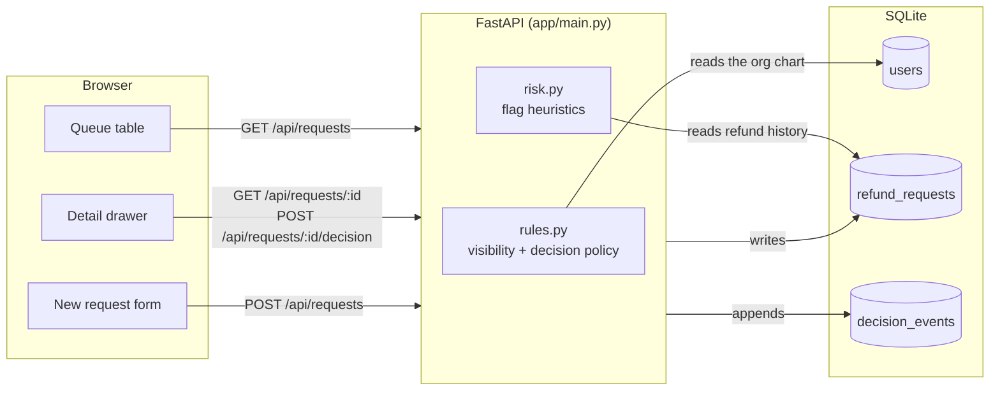
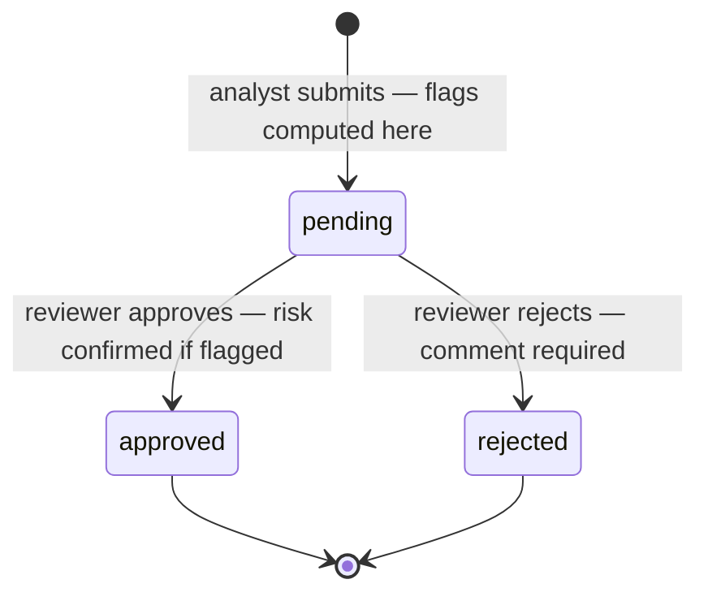
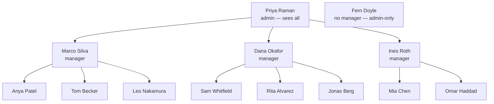

# Refund review (demo)

A queue for reviewing customer refund requests: an analyst submits one, a reviewer
approves or rejects it, and both see the decision history.

**Nothing is executed.** Approving a request records a decision; no payment provider
is called and no money moves.

## Run it

Two terminals.

```bash
# backend — http://127.0.0.1:8000
cd backend
python3 -m venv .venv && .venv/bin/pip install -r requirements.txt
.venv/bin/python -m app.seed          # drops and reseeds the demo database
.venv/bin/uvicorn app.main:app --reload
```

```bash
# frontend — http://localhost:5173 (proxies /api to the backend)
cd frontend
npm install
npm run dev
```

Pick who you are with the "Viewing as" selector in the header. There is no login:
the browser asserts a user id and the API trusts it, which is the first thing that
would have to go in a real deployment.

## Architecture

A React SPA talks to a FastAPI service over JSON; the service owns every rule and
SQLite holds the data. The frontend hides buttons it knows are pointless, but it is
not the security boundary — the same checks run again on the server, so a crafted
request gets the same answer as a clicked one.



Every call carries an `X-User-Id` header that the API trusts — the stand-in for
auth. `users.manager_id` is a self-referencing foreign key, so the org chart is
read live: reorg someone and their in-flight requests move to the new manager.

### Request lifecycle

A request is decided at most once. The write is a conditional update
(`UPDATE ... WHERE status = 'pending'`), so when two reviewers click at the same
moment the loser gets a 409 rather than silently overwriting the winner.



`decision_events` is append-only — submissions and decisions are both rows in it,
and `refund_requests.status` is a rollup kept for cheap filtering. Nothing edits
history.

## Hierarchy and visibility

Visibility follows the reporting line: **your own requests, plus your direct
reports'**. Not your skip-levels — a director does not automatically see their
reports' reports, by design. Admins see everything.



| Viewer | Sees | Can decide |
| --- | --- | --- |
| Analyst | only their own requests | nothing |
| Manager | their own + their direct reports' | their reports' requests, never their own |
| Admin | everything | everything except their own requests |

Two consequences worth knowing:

- **Requests outside your line return 404, not 403.** A 403 would confirm the id
  exists, which lets someone map another team's volume by probing ids.
- **Nobody approves their own request, admins included.** A manager's own refund
  goes up to *their* manager. Fern Doyle reports to no one, so her requests are
  decidable only by an admin — the deliberate edge case in the seed data.

## Flags and alerts

Flags are heuristics computed **once, at submit time**, and stored on the request.
They are frozen deliberately: reopening a six-month-old decision should show what
the reviewer actually saw, not what today's rules would say.

| Flag | Trigger | Why it matters |
| --- | --- | --- |
| High value | amount over $1,000 | the expensive mistake to make by reflex |
| Repeat refunds | 2+ approved refunds for this customer in 90 days | a pattern one request can't show |
| Rapid succession | 2+ requests for this customer in 24 hours | bursts look like testing a stolen card |
| Fraud dispute | the submitter chose that reason | the analyst is already suspicious |

What the flags *do*, in escalating order:

1. **No flags** — approve or reject straight away.
2. **Any one flag** — the reviewer must tick a confirmation checkbox before the
   approve button unlocks. Same approver, just friction against the reflex click.
3. **High value _plus_ any other flag** — the manager is blocked entirely and an
   admin has to approve. The drawer says so instead of offering a dead button.

Rejecting never needs risk confirmation, but always needs a comment — a decline is
the decision someone will later ask you to justify. Use the **Flagged only** filter
to triage the risky queue first.

## Layout

```
backend/app/models.py   tables
backend/app/risk.py     flag heuristics and the escalation rule
backend/app/rules.py    visibility and decision authorization
backend/app/main.py     HTTP layer
backend/app/seed.py     fake org chart and ~54 requests
frontend/src/           queue, detail panel, submit form
```

## Tests and lint

```bash
cd backend  && .venv/bin/python -m pytest && .venv/bin/ruff check app tests
cd frontend && npm run lint && npm run build
```
